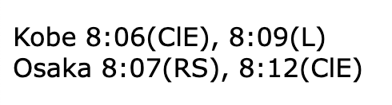

# Next Two Trains Javascript Code

This is a simple javascript app for showing the next two trains from a schedule.  It shows the trains going in two directions (Kobe and Osaka).
Next to the times are initials for the type of train L = Local, ClE = Commuter Limited Express, RS = Rapid Service.  Train schedule is hard-coded into the app, so no parsing of train-specific websites.

